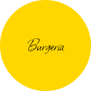
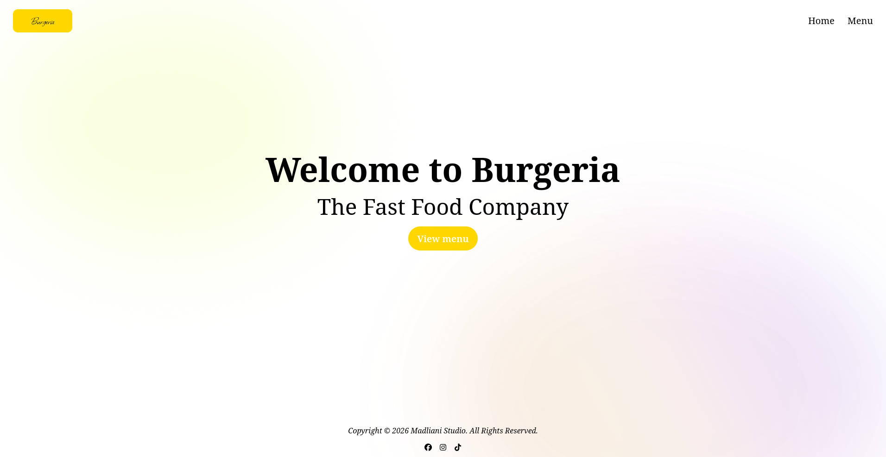

# Burgeria Website

    

    Burgeria Website

Burgeria is a fast food company. If you want a fast breakfast, fast lunch, or
fast dinner, Burgeria is your choice!

## Screenshots

## Usage

In the project directory, you can run:

### `pnpm serve`

Runs the app in the development mode.\
Open [http://localhost:4321](http://localhost:4321) to view it in the browser.

The page will reload if you make edits.\
You will also see any lint errors in the console.

### `pnpm build`

Builds the app for production to the `dist` folder.\
It correctly bundles React in production mode and optimizes the build for the
best performance.

The build is minified and the filenames include the hashes.\
Your app is ready to be deployed!
